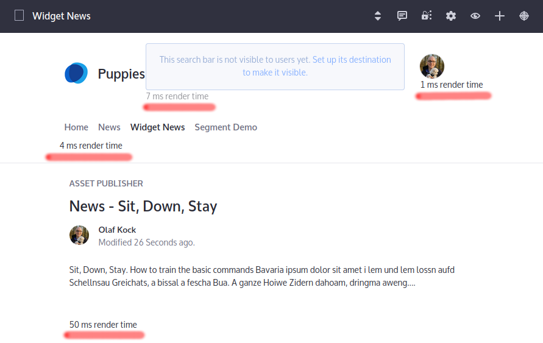

# Liferay Widget Monitoring

If you're wondering how long your individual applications (widgets only currently) take to render,
this plugin will provide the answer directly below the actual application (use only in nonproduction
environments, or utilize CSS to hide it

    .stopwatch { 
        display:none;
    }

You can also find the output after each page load in the logs, if you set the log level for 
`com.liferay.sales.monitoring.filter` to `INFO`.

## Built & Tested on

* DXP 7.3 FP2 
* Build instructions: Clone this repository into the `modules` directory of a Liferay Workspace
* optionally adjust dependencies, e.g. from `release.dxp.api` to `release.portal.api`
* Utilizes the workspace's target platform configuration

## To Do

* Extend to be useful with fragment rendering too